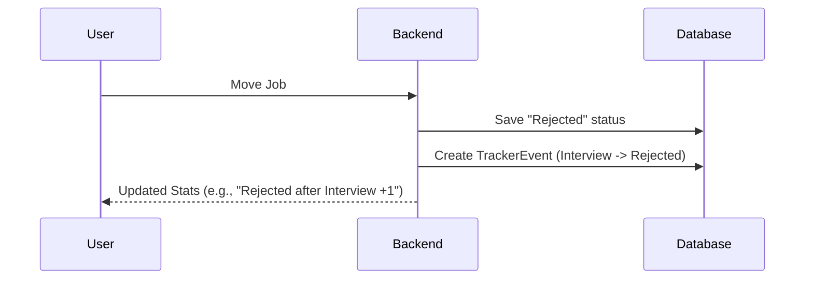

# Chapter 1: Application Tracker & Kanban Flow

Imagine you are applying for 50 jobs. Some are just "bookmarked," others you've interviewed for, and a few have sent rejection emails. If you use a simple spreadsheet, it quickly becomes a messy wall of text. You lose track of *when* you applied or *where* things went wrong.

The **Application Tracker** solves this by turning your job search into a visual "factory assembly line."

### The Kanban Concept
In project management, a **Kanban Board** is a way to visualize work moving through stages. In our `ai-job-assistant`, every job is a card, and the columns represent the "health" of your application:

1.  **Interested**: Jobs you found but haven't acted on yet.
2.  **Applied**: You've submitted your resume.
3.  **Follow Up**: You've sent a "thank you" or check-in note.
4.  **Interview**: You're actively talking to the company.
5.  **Offer**: The finish line!
6.  **Rejected**: Where jobs go to rest.

### 1. Recording the Journey: Tracker Events
Every time you move a job from "Applied" to "Interview," the system doesn't just change a label; it creates a **Tracker Event**. Think of this like a time-stamped logbook entry.

In `backend/app/models/tracker.py`, the data looks like this:

```python
class TrackerEvent(Base):
    __tablename__ = "tracker_events"
    # Which job is moving?
    job_id = Column(Integer, ForeignKey("jobs.id"))
    # Where did it start? (e.g., "applied")
    from_status = Column(String, default="")
    # Where is it going? (e.g., "interview")
    to_status = Column(String, default="")
    # When did this happen?
    created_at = Column(DateTime, server_default=func.now())
```
*This allows the AI to later tell you: "It took you 5 days on average to get an interview after applying."*

### 2. The Visual Board
On the frontend, we use a drag-and-drop interface. When you move a card, the UI tells the backend to update the status.

In `frontend/src/pages/Tracker.tsx`, we define the flow:
```typescript
const STATUS_FLOW = ['interested', 'applied', 'follow_up', 'interview', 'offer']

const moveJob = async (jobId: number, newStatus: string) => {
  // 1. Tell the Job Store to update the status in the database
  await updateJob(jobId, { status: newStatus })
  // 2. Refresh the board to show the card in the new column
  fetchBoard()
}
```
*By clicking a button or dragging a card, the `moveJob` function handles the heavy lifting of updating your records.*

### 3. The "Rejected Bin" Logic
Most trackers just delete rejected jobs or hide them. Our assistant uses a **Rejected Bin** to help you analyze your "failure points."

If a job moves to "Rejected," the system looks at its *previous* stage.
*   Rejected from **Interested**? You probably decided the job wasn't a good fit.
*   Rejected after **Interview**? You might need to work on your interviewing skills.



### How to use the Tracker
1.  **Find a job**: It starts in the "Interested" column.
2.  **Apply**: Click the "Apply" button. The job moves to "Applied" automatically.
3.  **Progress**: As you get emails, drag the job to "Interview" or "Offer."
4.  **Analyze**: Check the **Rejected Bins** at the bottom of the page to see if you are getting stuck at the "Applied" stage (maybe your resume needs work) or the "Interview" stage.

### Summary
In this chapter, we learned how to organize a chaotic job search into a structured pipeline. We saw how **Tracker Events** act as a history log and how the **Kanban Board** provides a visual bird's-eye view of your progress.

Now that we have a place to track jobs, how do we find them in the first place?

[Next Chapter: Job Search Orchestrator & Providers](02_job_search_orchestrator___providers_.md)

---

Generated by [AI Codebase Knowledge Builder](https://github.com/The-Pocket/Tutorial-Codebase-Knowledge)