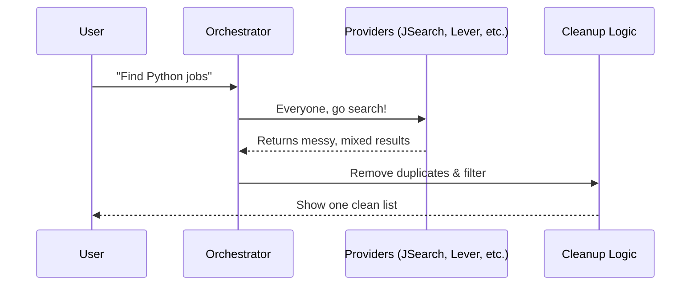

# Chapter 2: Job Search Orchestrator & Providers

In [Chapter 1: Application Tracker & Kanban Flow](01_application_tracker___kanban_flow_.md), we built a "factory line" to manage your job applications. But how do we get the jobs into that factory in the first place? 

Searching for jobs manually is exhausting. You have to check LinkedIn, then Indeed, then refresh the career pages of five different startups. It’s like trying to find the best flight by visiting every airline's website individually.

### The Travel Agent for Jobs
The **Job Search Orchestrator** is like a specialized travel agent. Instead of you doing the legwork, you tell the Orchestrator: *"Find me 'Python Developer' roles in 'Berlin' that are 'Remote'."*

The Orchestrator then sends out **Providers** (its scouts) to different corners of the internet. It gathers everything they find, cleans up the messy data, and hands you a neat, unified list.

### Key Concept 1: The Providers (The Scouts)
A **Provider** is a small script dedicated to talking to one specific source. 
*   **Aggregator Providers:** Talk to big sites like JSearch or Adzuna.
*   **ATS Providers:** Talk directly to company job boards like Greenhouse or Lever.

Because every website formats its data differently (one might call it "Position," another calls it "Job Title"), each Provider "normalizes" the data into a standard format our app understands.

### Key Concept 2: The Orchestrator (The Boss)
The **Orchestrator** (found in `job_search.py`) is the brain. It doesn't know how to scrape a website itself; it just knows which Providers are available and how to combine their results.

### How it works: A Step-by-Step Journey

When you click "Search," here is what happens behind the scenes:



### Under the Hood: The Orchestrator
The Orchestrator's main job is to loop through all the active providers and collect their findings.

In `backend/app/services/job_search.py`:
```python
# Create a list to hold all found jobs
all_jobs = []

# Ask JSearch for jobs
if "jsearch" in requested_sources:
    results = search_jsearch(query, location, api_key)
    all_jobs.extend(results)

# Ask Lever (company boards) for jobs
if "lever" in requested_sources:
    results = search_lever(query, company_slugs)
    all_jobs.extend(results)
```
*The Orchestrator acts as a collector, gathering lists from different sources into one big `all_jobs` bucket.*

### Under the Hood: The Providers
Each provider is a specialist. For example, the **Lever Provider** knows exactly how to read a company's career page.

In `backend/app/services/providers/lever.py`:
```python
# Connect to a company's Lever board
url = f"https://api.lever.co/v0/postings/{company_slug}"
data = http_get_json(url)

# Turn their data into OUR format
for item in data:
    job = {
        "title": item.get("text"),
        "company": company_slug,
        "url": item.get("hostedUrl")
    }
```
*The Provider translates "Lever-speak" into "Assistant-speak" so the rest of our app doesn't have to worry about where the job came from.*

### Smart Deduplication
What if a job is posted on both Adzuna and JSearch? You don't want to see it twice. The Orchestrator performs a "Dedupe" (De-duplication) by creating a unique fingerprint for every job.

```python
# Create a unique key based on title, company, and location
key = f"{title}|{company}|{location}"

if key in already_seen:
    # Skip it, we already have this job!
    continue
```
*This ensures your search results stay clean and you don't waste time looking at the same post twice.*

### Summary
In this chapter, we learned how the **Orchestrator** manages a team of **Providers** to scan the internet for us. This abstraction allows our app to treat a tiny startup's career page and a massive global job board exactly the same way.

We have the jobs, and we have a board to track them. But what if a job listing is just a link to a messy webpage without an API?

[Next Chapter: Site Scrapers & Link Analysis](03_site_scrapers___link_analysis_.md)

---

Generated by [AI Codebase Knowledge Builder](https://github.com/The-Pocket/Tutorial-Codebase-Knowledge)