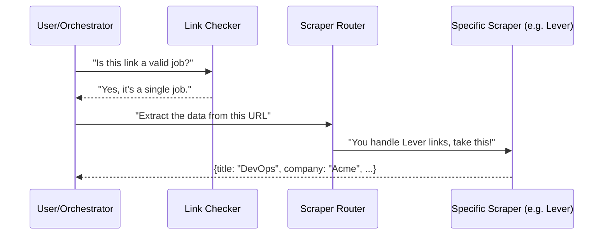

# Chapter 3: Site Scrapers & Link Analysis

In [Chapter 2: Job Search Orchestrator & Providers](02_job_search_orchestrator___providers_.md), we learned how to find job listings from across the web. But once we have a link, how does our AI actually "read" the job description to help us apply?

### The "Wall of Text" Problem
Imagine you click a link to a job at a cool startup. One company uses **Greenhouse** to show their jobs, another uses **Lever**, and a third has a custom-built careers page. 

To a computer, these pages are just a messy soup of HTML code. If we want our AI to tell us the salary or the specific skills required, we need a way to extract that information reliably. **Site Scrapers** act like a pair of "Smart Glasses" that filter out the website's navigation, footers, and ads, leaving only the important job details.

---

### Key Concept 1: The Specialized Scrapers (The Librarians)
Different job platforms (like LinkedIn or Greenhouse) hide their data in different places. Our app uses specialized scrapers that know the "layout" of these popular sites.

*   **Greenhouse Scraper:** Knows to look for a tag called `.app-title`.
*   **Lever Scraper:** Looks for a section called `.posting-headline`.
*   **LinkedIn Scraper:** Extracts data from "Meta Tags" (hidden data meant for social media).

### Key Concept 2: The Generic Scraper (The Detective)
What if the job is on a tiny company's private blog? We use a **Generic Scraper**. It uses "pattern matching" to guess. If it sees a large block of text with the word "Requirements," it assumes that is the job description.

### Key Concept 3: Link Analysis (The Traffic Guard)
Not every link is a job. Sometimes a link leads to a **Job Board** (a list of 20 jobs) or an **Expired Page** (404 Error). The Link Checker visits the URL first to make sure it's a single, active job before we waste time processing it.

---

### How it Works: From URL to Data
When you give the app a URL, it follows this flow:



### 1. Checking the Link
Before scraping, we check if the link is "healthy." In `backend/app/services/link_checker.py`, we look for "Red Flag" phrases:

```python
# Check for expired / filled indicators
expired_phrases = [
    "position has been filled",
    "job not found",
    "posting has been closed"
]
# If the page contains these, we mark it as 'expired'
if any(phrase in lower_page_text for phrase in expired_phrases):
    return "expired"
```
*This prevents the AI from trying to apply to a job that no longer exists.*

### 2. Choosing the Right Tool
The **Router** in `backend/app/services/site_scrapers.py` looks at the URL and decides which scraper to use:

```python
# The Router picks the best tool for the job
def scrape_url(url, html):
    for scraper in _SCRAPERS:
        if scraper.can_handle(url): # Does it say 'lever.co'?
            return scraper.extract(html, url)
    
    # If no match, use the detective
    return GenericScraper().extract(html, url)
```
*It’s like a toolbox where the app automatically picks the right wrench for the bolt.*

### 3. Extracting the Details
Inside a specific scraper (like `GreenhouseScraper`), we target specific parts of the page. We often use **JSON-LD**, which is a hidden "data card" many websites provide specifically for search engines.

```python
# In greenhouse.io scraper
jld = _extract_json_ld(soup) # Look for the hidden data card
if jld:
    result.title = jld.get("title")
    result.company = jld.get("hiringOrganization", {}).get("name")
    result.description = jld.get("description")
```
*By reading this hidden data, we get 100% accuracy without having to guess.*

---

### Real-World Example
**Input URL:** `https://jobs.lever.co/google/12345`

1.  **Link Checker:** Sees "jobs.lever.co" and confirms it's a single job post, not a list.
2.  **Router:** Sees "lever.co" and hands the page to the `LeverScraper`.
3.  **Scraper:** Pulls out "Software Engineer," "Google," and the full 2,000-word description.
4.  **Output:** A clean JSON object ready for the AI to analyze.

### Summary
In this chapter, we learned how the app "reads" the internet. We use **Link Analysis** to filter out dead ends and **Site Scrapers** to turn messy websites into clean data. This structured data is the "fuel" that our AI needs to work its magic.

Now that we have the job details, how do we actually start the application process?

[Next Chapter: Quick Apply & Apply Planner](04_quick_apply___apply_planner_.md)

---

Generated by [AI Codebase Knowledge Builder](https://github.com/The-Pocket/Tutorial-Codebase-Knowledge)