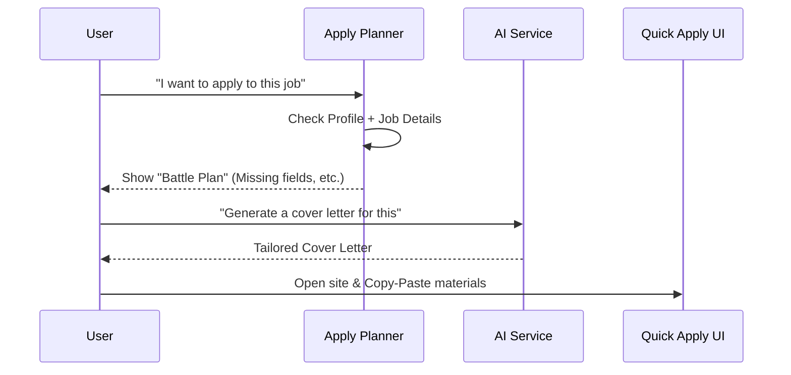

# Chapter 4: Quick Apply & Apply Planner

In [Chapter 3: Site Scrapers & Link Analysis](03_site_scrapers___link_analysis_.md), we learned how the assistant "reads" a job posting to understand the role. But reading is only half the battle. Now comes the "last mile": actually filling out the forms and hitting the "Submit" button.

### The "Application Fatigue" Problem
Imagine you’ve found 10 perfect jobs. For each one, you have to:
1. Open the page.
2. Find your resume file.
3. Write a custom cover letter.
4. Answer "tricky" questions like *"Why do you want to work here?"* or *"What is your expected salary?"*

By the third application, most people get tired and start making mistakes. The **Quick Apply & Apply Planner** system acts like a professional "pit crew" for your job search, handling the repetitive prep work so you can focus on the finish line.

---

### Key Concept 1: The Apply Planner (The Battle Plan)
Before you do anything, the **Apply Planner** looks at the job and your profile to create a "Battle Plan." It checks if you have everything ready or if you're missing something important (like a phone number in your profile).

### Key Concept 2: The Adapter (The Universal Key)
Every job site is different. Some use **Greenhouse**, some use **Lever**, and some are just basic websites. The Planner identifies which "Adapter" to use so it knows exactly how to talk to that specific site.

### Key Concept 3: The AI Chat Assistant (The Expert at Your Side)
Sometimes an application asks a weird question you didn't prepare for. Instead of staring at a blank screen, you can ask the built-in AI: *"How should I answer the question about my experience with Kubernetes based on my resume?"*

---

### How it Works: The Application Workflow

When you decide to apply for a job, the system follows this flow:



---

### 1. Building the Plan
The Planner's first job is to see what's missing. It compares the "Required Fields" (like email, resume, etc.) against your saved profile.

In `backend/app/services/apply_planner.py`:
```python
# We define what every application usually needs
CANONICAL_FIELDS = ["full_name", "email", "resume", "cover_letter"]

def check_missing(profile, cover_letter):
    missing = []
    # Check if the user has provided a name
    if not profile or not profile.full_name:
        missing.append("full_name")
    # ... checks other fields ...
    return missing
```
*If you haven't uploaded a resume yet, the Planner will flag it here so you don't get stuck later.*

### 2. Identifying the Site Type
The Planner also tries to guess what kind of "Application Engine" the company uses by looking at the URL.

```python
def detect_site_type(url):
    if "lever.co" in url:
        return "lever", 0.95 # 95% confident it's a Lever site
    if "greenhouse.io" in url:
        return "greenhouse", 0.95
    return "generic", 0.35 # Not sure, use standard mode
```
*This helps the UI show you the right instructions for that specific website.*

### 3. The Quick Apply Interface
On the frontend, we use a "Step-by-Step" wizard. This keeps you focused so you don't get overwhelmed by the "Wall of Text" on a job board.

In `frontend/src/pages/QuickApply.tsx`:
```typescript
// We track where the user is in the process
type Step = 'input' | 'confirming' | 'generating' | 'reviewing' | 'applied'

const [currentStep, setCurrentStep] = useState<Step>('input')
```
*By breaking the process into small steps (Confirm Details -> Generate Letter -> Download Files), the app makes applying feel like a simple checklist.*

### 4. Chatting with the Application
If a form asks a tough question, the `apply_chat` function uses the [AI Service & Prompt Engineering](05_ai_service___prompt_engineering_.md) to help you answer.

In `backend/app/routers/apply.py`:
```python
@router.post("/chat")
def ask_ai_assistant(user_question, job_details, profile_text):
    # The AI looks at the job and your resume to help
    answer = ai_service.answer_question(
        question=user_question,
        context=job_details + profile_text
    )
    return {"answer": answer}
```
*It’s like having a career coach sitting next to you, reading your resume and the job description at the same time.*

---

### Real-World Example
1. **The Trigger:** You find a "Frontend Developer" role at Google.
2. **The Plan:** The Planner sees it's a **Google** job (using a specific ATS) and notices you don't have a **Cover Letter** generated yet.
3. **The Prep:** You click "Generate," and the AI writes a letter emphasizing your React skills because the job description mentioned it.
4. **The Action:** The app provides a "Copy" button for your new letter and a "Download" button for your Resume.
5. **The Finish:** You paste them into the Google site, click "Mark as Applied," and the job moves to the "Applied" column on your [Application Tracker & Kanban Flow](01_application_tracker___kanban_flow_.md).

### Summary
In this chapter, we explored how the **Apply Planner** organizes the chaos of applying. We saw how it identifies missing information, detects the type of job site, and provides an AI chat assistant to help with the hard questions.

Now that we have a plan, how does the AI actually "write" like you?

[Next Chapter: AI Service & Prompt Engineering](05_ai_service___prompt_engineering_.md)

---

Generated by [AI Codebase Knowledge Builder](https://github.com/The-Pocket/Tutorial-Codebase-Knowledge)