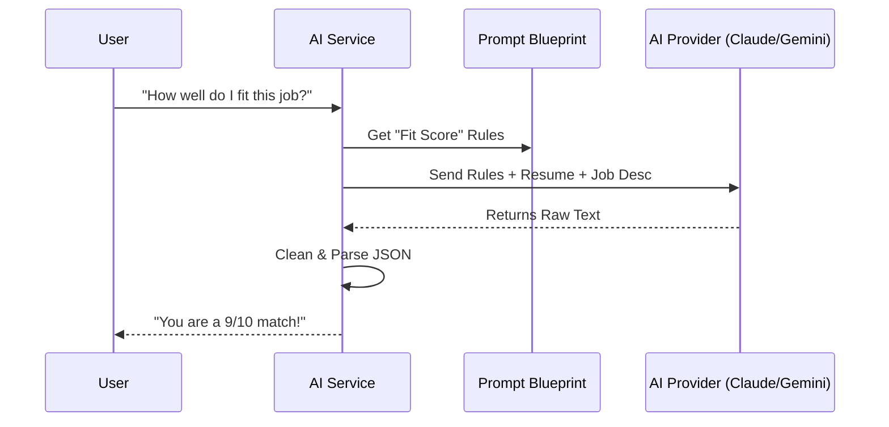

# Chapter 5: AI Service & Prompt Engineering

In [Chapter 4: Quick Apply & Apply Planner](04_quick_apply___apply_planner_.md), we learned how to create a "Battle Plan" for job applications. But a plan is just a list of tasks. To actually write the cover letter or analyze your resume, we need a "Brain."

### The "Multilingual Brain" Problem
Imagine you want to hire a personal assistant. One candidate only speaks English, another only speaks French, and a third speaks a rare dialect. If you want them to do the same task, you have to explain it differently to each one.

In the world of AI, **Anthropic (Claude)**, **Google (Gemini)**, and **Alibaba (Qwen)** are like these different assistants. They all have different "APIs" (ways of talking). If you decide to switch from Claude to Gemini, you shouldn't have to rewrite your entire application.

The **AI Service** acts as a universal translator. You give it a simple command, and it handles the complex "tech-speak" required to talk to any AI provider you choose.

---

### Key Concept 1: The AI Service (The Translator)
The `AIService` is a "wrapper." It hides the messy details of API keys, URLs, and JSON formatting. Whether you use a super-powerful model for writing or a fast, cheap model for simple math, the rest of the app just calls one function: `ai_service.call()`.

### Key Concept 2: Prompt Engineering (The Blueprints)
AI isn't magic; it needs clear instructions. A **Prompt** is a set of rules we give the AI. 
*   **System Prompt:** The "Personality" (e.g., "You are a world-class career coach").
*   **User Prompt:** The "Task" (e.g., "Write a cover letter for this specific job").

By separating these, we ensure the AI always behaves professionally and stays on track.

---

### How it Works: The AI Request Flow

When you ask the app to "Score my fit for this job," here is what happens:



---

### 1. The Universal Wrapper
Inside `backend/app/services/ai_service.py`, the app decides which "language" to speak based on your settings.

```python
# Choose the provider based on your config
if self.provider == "anthropic":
    return self._call_anthropic(system, user, model)
if self.provider == "gemini":
    return self._call_gemini(system, user, model)
# Default to Qwen
return self._call_qwen(system, user, model)
```
*This means the "Brain" of your app can be swapped out in seconds without breaking the UI.*

### 2. Teaching the AI a "Voice"
To make sure the AI doesn't sound like a robot, we use **Voice Analysis**. We give it samples of your writing, and it creates a "Style Blueprint."

In `backend/app/prompts/voice_analysis.py`:
```python
VOICE_ANALYSIS_SYSTEM = """Analyze these writing samples.
Describe the Tone (formal/casual) and 
Sentence structure (short/long).
This will be used to match the candidate's voice."""
```
*By defining this once, every cover letter the AI writes will actually sound like you wrote it.*

### 3. Structured Thinking (JSON)
Computers hate "walls of text." They love lists and numbers. We use prompts to force the AI to return **JSON** (a structured format).

In `backend/app/prompts/fit_score.py`:
```python
FIT_SCORE_SYSTEM = """Return ONLY a valid JSON object:
{
  "score": <1-10>,
  "top_reasons": ["reason1", "reason2"],
  "summary": "..."
}"""
```
*This allows our [Application Tracker & Kanban Flow](01_application_tracker___kanban_flow_.md) to show a nice "85%" badge instead of a long, rambling paragraph.*

### 4. Cleaning the Output
Sometimes AI assistants are "chatty" and add extra text like *"Sure, here is your JSON!"*. Our service has a "cleaner" function to scrub that away.

```python
def _extract_json_text(self, raw_text: str):
    # Find the first '{' and the last '}'
    start = raw_text.find("{")
    end = raw_text.rfind("}")
    # Return only the stuff in the middle
    return raw_text[start : end + 1]
```
*This ensures the backend doesn't crash if the AI decides to be a bit too friendly.*

---

### Example Use Case: Parsing a Resume
1. **Input:** You upload a messy PDF of your resume.
2. **The Prompt:** The `RESUME_PARSE_SYSTEM` tells the AI: *"You are a resume expert. Find the 'Education' and 'Skills' sections."*
3. **The Logic:** The AI Service sends this to Claude (or Qwen).
4. **The Result:** The raw text is turned into a clean list of skills that the [Quick Apply & Apply Planner](04_quick_apply___apply_planner_.md) can use to fill out forms.

### Summary
In this chapter, we explored the "Brain" of the application. We learned how the **AI Service** abstracts away different providers and how **Prompt Engineering** ensures the AI provides structured, high-quality insights. 

We now have a powerful backend that can find jobs, scrape data, and think like a human. But how do we keep all this data synced up in the browser?

[Next Chapter: Zustand State Management (Frontend Stores)](06_zustand_state_management__frontend_stores__.md)

---

Generated by [AI Codebase Knowledge Builder](https://github.com/The-Pocket/Tutorial-Codebase-Knowledge)