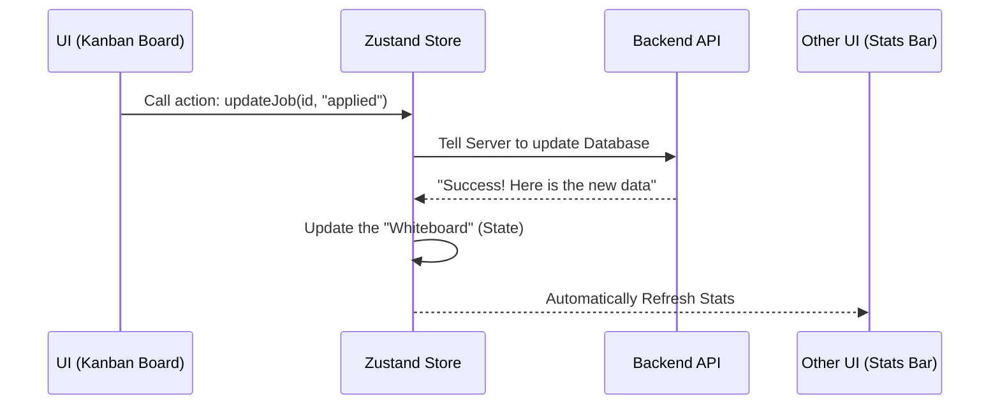

# Chapter 6: Zustand State Management (Frontend Stores)

In [Chapter 5: AI Service & Prompt Engineering](05_ai_service___prompt_engineering_.md), we built the "Brain" of our assistant. We can now generate cover letters and analyze resumes. But if you're in the middle of a job search, you don't want to wait for the "Brain" to re-calculate everything every time you click a button. You want the app to feel instant.

### The "Goldfish Memory" Problem
Imagine you are using a banking app. You update your profile picture on the "Settings" page, but when you go back to the "Home" page, the old picture is still there. You have to refresh the whole app to see the change. This happens because the "Home" page doesn't know what the "Settings" page did.

In our `ai-job-assistant`, we have many pages: the Kanban board, the Job searcher, and the Profile editor. **Zustand** is our application's "Short-Term Memory" (or a "Store"). It ensures that if you change a job's status in one place, every other part of the app finds out *instantly*.

---

### Key Concept 1: The Central Hub (The Store)
Instead of each page keeping its own private notes, all data lives in a central "Store." Think of it like a **Whiteboard** in the middle of an office. If anyone changes a number on the whiteboard, everyone in the room sees it immediately.

### Key Concept 2: Subscribing (The Notifications)
Components (parts of your UI) "subscribe" to the store. It’s like following someone on social media. When the store updates, Zustand automatically "pings" the components to redraw themselves with the new data.

### Key Concept 3: Actions (The Remote Control)
You don't just grab data from the store; you use **Actions** to change it. Actions are functions like `fetchJobs()` or `updateJob()`. They handle the "boring" stuff like talking to the server and then updating the "Whiteboard."

---

### How it Works: The Data Flow

When you move a job to the "Applied" column, Zustand coordinates the update:



---

### 1. Creating a Store
We use the `create` function from Zustand to define our memory. Let's look at a simplified version of the `jobStore.ts`.

```typescript
// Define what our "Short-Term Memory" looks like
export const useJobStore = create<JobState>((set) => ({
  jobs: [], // Start with an empty list
  loading: false,

  // Action: Fetch jobs from the server
  fetchJobs: async () => {
    set({ loading: true })
    const { data } = await api.get('/jobs')
    set({ jobs: data, loading: false }) // Update the whiteboard
  },
}))
```
*This store keeps track of our job list. When `set` is called, any page showing jobs will automatically update.*

### 2. Updating Data Everywhere
When you update a job, we don't want to re-download the whole list. We just swap out that one job in our memory.

```typescript
updateJob: async (id, updates) => {
  // 1. Tell the backend to save the change
  const { data } = await api.put(`/jobs/${id}`, updates)
  // 2. Find the old job in our memory and replace it with 'data'
  set((state) => ({
    jobs: state.jobs.map((j) => (j.id === id ? data : j))
  }))
}
```
*By using `.map()`, we surgically update only the job that changed. This is why the app feels so fast!*

### 3. Organizing by Category
Our app has different "folders" of memory. We use different stores for different tasks:
*   **JobStore**: For the list of jobs and search results.
*   **TrackerStore**: For the [Kanban Flow](01_application_tracker___kanban_flow_.md) and stats.
*   **ProfileStore**: For your resume and [AI Voice Profile](05_ai_service___prompt_engineering_.md).
*   **CoverLetterStore**: For the letters created by the [Apply Planner](04_quick_apply___apply_planner_.md).

---

### Using the Store in a Component
To use this in a real screen (like `Tracker.tsx`), it only takes two lines of code:

```typescript
function TrackerPage() {
  // Grab exactly what we need from the "Whiteboard"
  const { board, fetchBoard } = useTrackerStore()

  // When the page opens, tell the store to go get the data
  useEffect(() => { fetchBoard() }, [])

  return <div>{/* Map through board.applied, board.interview, etc. */}</div>
}
```
*The component doesn't need to know HOW to fetch data; it just asks the store for the `board` and trusts it will be there.*

---

### Under the Hood: The Profile Store
The `profileStore.ts` handles complex tasks like uploading a resume. It manages the "Loading" state so the UI can show a spinner while the AI is thinking.

```typescript
uploadResume: async (file) => {
  set({ loading: true, error: null })
  try {
    // Send file to backend
    const { data } = await api.post('/profile/upload-resume', formData)
    // Update the profile in memory
    set({ profile: data, loading: false })
  } catch (err) {
    set({ error: 'Upload failed', loading: false })
  }
}
```
*Because the `loading` state is in the store, we can show a progress bar on the Header, the Sidebar, or the Main Page simultaneously.*

### Summary
In this chapter, we learned how **Zustand** acts as the "Short-Term Memory" for our frontend. It prevents us from having to constantly ask the server for data and ensures that every part of our app stays in sync. By using **Stores**, **Actions**, and **Subscribing**, we created a snappy, responsive user experience.

We have a powerful frontend and a smart backend. But how do they actually talk to each other when the app is running on your desktop?

[Next Chapter: Frontend-Backend Communication](07_frontend_backend_communication.md)

---

Generated by [AI Codebase Knowledge Builder](https://github.com/The-Pocket/Tutorial-Codebase-Knowledge)