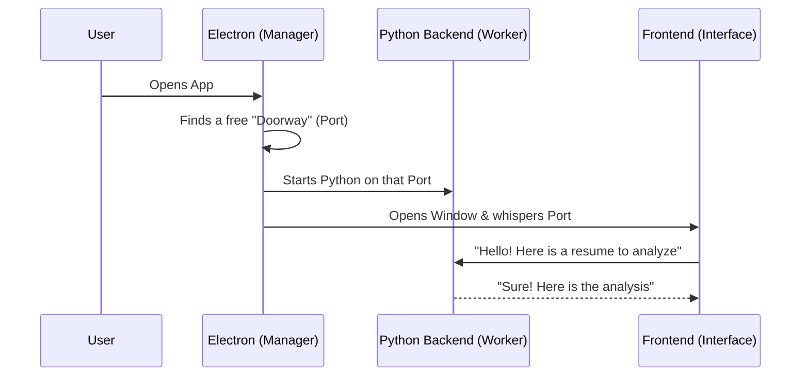

# Chapter 7: Electron-Backend Bridge

In [Chapter 6: Zustand State Management](06_zustand_state_management__frontend_stores__.md), we learned how the frontend remembers your data while the app is running. But where does that data actually come from? Since our AI Assistant uses powerful Python libraries, it can't run entirely inside a web browser. It needs a real computer "brain" (the Backend) to do the heavy lifting.

### The "Two-Language" Problem
Imagine you have a translator (the Frontend) who speaks beautiful visual languages like HTML and CSS, and a scientist (the Backend) who only speaks Python. They live in the same house (your computer), but they need a way to talk. 

If this were a website, the scientist would live on a far-away server. But because this is a **Desktop App**, both the translator and the scientist are running on *your* machine. The **Electron-Backend Bridge** is the "hidden tunnel" that connects them, making sure they can find each other every time you open the app.

---

### Key Concept 1: The "Digital Doorway" (Dynamic Port)
In the world of networking, a **Port** is like a numbered door to a building. Usually, web apps use door #8000. But what if another app on your computer is already using that door? Our bridge is smart: it looks for any empty "doorway" and tells both sides to use it.

### Key Concept 2: The Process Spawner
When you double-click the app icon, Electron doesn't just show a window; it acts like a manager who hires a Python worker. It "spawns" (starts) the Python backend in the background so you don't have to manually run any code.

### Key Concept 3: The Injection
Once the "doorway" number is chosen, Electron "injects" that number into the Frontend's memory. This way, the Frontend knows exactly where to send its requests for cover letters or job searches.

---

### How it Works: The Startup Sequence

When you launch the AI Job Assistant, this sequence happens in seconds:



---

### 1. Finding a Free Doorway
First, Electron needs to find a port that isn't being used. We use a helper function in `frontend/electron/main.ts`:

```typescript
function findFreePort(): Promise<number> {
    return new Promise((resolve) => {
        const server = net.createServer();
        // Listen on port '0' to let the OS pick any empty spot
        server.listen(0, "127.0.0.1", () => {
            const port = (server.address() as net.AddressInfo).port;
            server.close(() => resolve(port));
        });
    });
}
```
*By asking for port "0", the computer says: "Here is a random empty room you can use!"*

### 2. Starting the Python Worker
Once we have a port (let's say 54321), Electron starts the Python backend and hands it that number.

```typescript
function startBackend(port: number) {
    // Locate the Python "scientist" file
    const binaryPath = resourcePath("backend-dist", "ai-job-backend");
    
    // Start it and tell it which port to use
    backendProcess = spawn(binaryPath, ["--port", String(port)]);
}
```
*The `spawn` command is like Electron saying: "Start working, and listen for instructions on Port 54321!"*

### 3. Telling the Frontend where to look
Finally, Electron opens the visual window and "injects" the port number so the [Zustand Stores](06_zustand_state_management__frontend_stores__.md) know where to send data.

```typescript
// Inside the 'createWindow' function
mainWindow.webContents.executeJavaScript(
    `window.__BACKEND_PORT__ = ${backendPort};`
);
```
*This line of code is like sticking a post-it note on the Frontend's forehead that says: "The Python guy is at Port 54321."*

---

### 4. Making the Connection
In the actual application code (`frontend/src/api/client.ts`), the Frontend looks for that "post-it note" before sending any messages.

```typescript
function getBaseURL(): string {
  // Check if Electron gave us a specific port
  if (window.__BACKEND_PORT__) {
    return `http://localhost:${window.__BACKEND_PORT__}/api`
  }
  // Fallback for regular web development
  return '/api'
}
```
*This allows the same code to work whether you are a developer testing in a browser or a user running the desktop app.*

---

### Under the Hood: The Python Side
On the other side of the bridge, the Python backend (in `backend/app/main.py`) is waiting patiently. It uses a library called `uvicorn` to listen to that specific doorway.

```python
if __name__ == "__main__":
    # Python reads the port number Electron sent
    parser.add_argument("--port", type=int, default=8000)
    args = parser.parse_args()

    # Start the server 'brain'
    uvicorn.run(app, host="127.0.0.1", port=args.port)
```
*Because the Python side is flexible, it doesn't care which port it gets; it just starts working wherever it's told.*

### Summary
In this chapter, we learned how the **Electron-Backend Bridge** connects our beautiful React frontend with our smart Python backend. We saw how Electron finds an available **Port**, starts the backend as a **Sub-process**, and ensures the two sides can communicate seamlessly. 

This bridge is the "secret sauce" that makes a complex Python AI application feel like a simple, lightweight desktop program.

**Congratulations!** You've completed the core concepts of the `ai-job-assistant`. You now understand how we track jobs, find them online, scrape data, use AI to help you apply, manage state, and bundle it all into a desktop app.

[Back to Chapter 1: Application Tracker & Kanban Flow](01_application_tracker___kanban_flow_.md)

---

Generated by [AI Codebase Knowledge Builder](https://github.com/The-Pocket/Tutorial-Codebase-Knowledge)