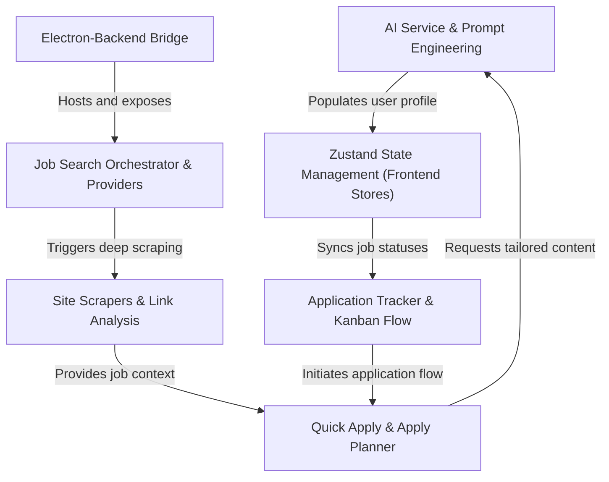

# Tutorial: ai-job-assistant

The **AI Job Assistant** is a desktop application designed to *automate and organize* the modern job search. It uses **AI-driven insights** to parse resumes, analyze a user's unique writing voice, and generate *tailored cover letters* that sound human. The app functions as a **centralized command center**, allowing users to scrape job details from various websites, track their application progress through a **Kanban-style pipeline**, and receive step-by-step guidance for completing applications.

**Source Repository:** [None](None)

## Chapters

1. [Application Tracker & Kanban Flow
](01_application_tracker___kanban_flow_.md)
2. [Job Search Orchestrator & Providers
](02_job_search_orchestrator___providers_.md)
3. [Site Scrapers & Link Analysis
](03_site_scrapers___link_analysis_.md)
4. [Quick Apply & Apply Planner
](04_quick_apply___apply_planner_.md)
5. [AI Service & Prompt Engineering
](05_ai_service___prompt_engineering_.md)
6. [Zustand State Management (Frontend Stores)
](06_zustand_state_management__frontend_stores__.md)
7. [Electron-Backend Bridge
](07_electron_backend_bridge_.md)

---

Generated by [AI Codebase Knowledge Builder](https://github.com/The-Pocket/Tutorial-Codebase-Knowledge)